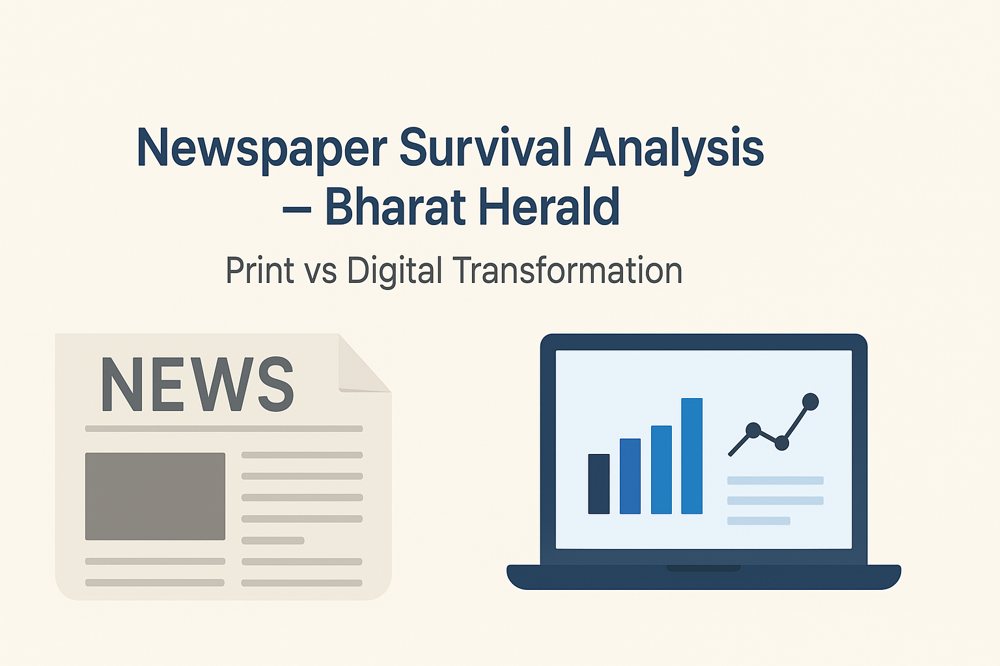

# Newspaper Survival Analysis – Bharat Herald  

  
  
  
  
  

  

---

## 📌 Project Overview
This project explores the **survival strategy of a newspaper company (Bharat Herald)** in the face of digital transformation. Using real-world inspired datasets, the analysis evaluates:
- Print vs. digital performance  
- Revenue streams  
- City readiness for digital adoption  
- Ad-hoc business requests  

The solution is implemented in a **Jupyter Notebook**, supported by structured datasets, and explained through detailed business problem statements.

---

## 📂 Repository Structure

📁 Newspaper-Survival-Analysis-Bharat-Herald-main

│── How to Get Started (A Step-by-Step Guide).pdf # Beginner’s guide

│── Media_Problem Statement.pdf # Business problem description

│── Primary_and_Secondary_Analysis.pdf # Analysis documentation

│── ad-hoc-requests.pdf # Additional business queries

│── metadata.txt # Dataset metadata

│── video_presentation_background_img.jpg # Presentation background


├── 📁 Datasets

│ ├── dim_ad_category.xlsx # Ad category dimension data

│ ├── dim_city.xlsx # City demographic data

│ ├── fact_ad_revenue.csv # Newspaper ad revenue

│ ├── fact_city_readiness.csv # City readiness for digital

│ ├── fact_digital_pilot.csv # Digital pilot performance

│ ├── fact_print_sales.xlsx # Print sales data

│ └── metadata.txt # Metadata reference
│

└── 📁 Solution Code

└── project-phoenix-a-newspaper-s-survival-guide.ipynb

└── app.py


---

## 🚀 How to Run
1. Clone this repository:
   ```bash
   git clone https://github.com/your-username/Newspaper-Survival-Analysis-Bharat-Herald.git
   cd Newspaper-Survival-Analysis-Bharat-Herald-main
   ```

## 📊 Key Insights
- Comparative analysis between **print & digital sales**  
- **Ad revenue breakdown** across categories and cities  
- **Digital pilot study** outcomes and readiness of cities  
- Strategic recommendations for **sustaining revenue in the digital era**  

---

## 📜 Files to Explore
- **Problem Statements:** Define the scope of business challenges  
- **Datasets:** Provide structured information for analysis  
- **Notebook:** Implements EDA, visualization, and business insights  

